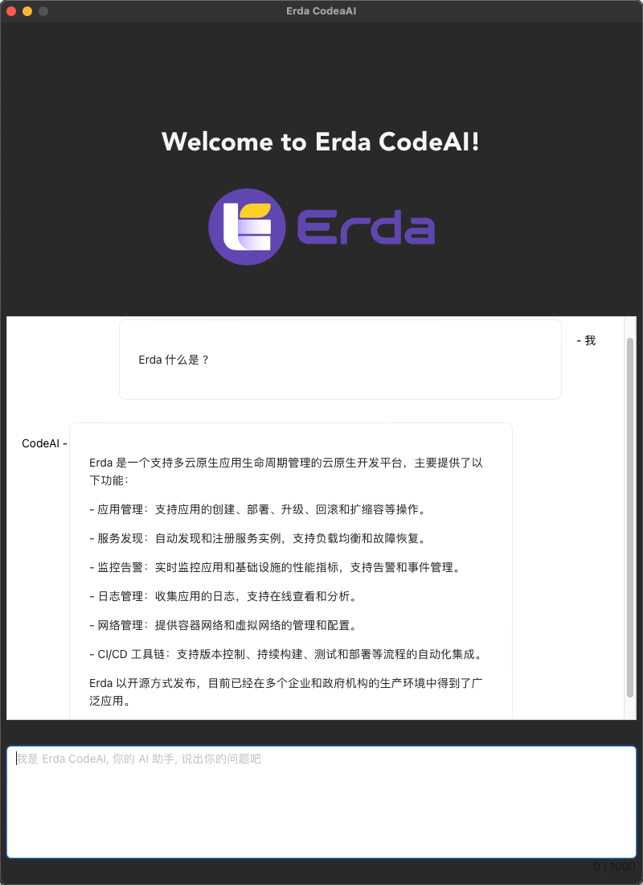

# Erda CodeAI App



# 运行项目

## 开发调试

```shell
cargo tauri dev
```

# Tauri + React + Typescript

This project is developing with Tauri, React and Typescript in Vite.

## Recommended IDE Setup

- [VS Code](https://code.visualstudio.com/) + [Tauri](https://marketplace.visualstudio.com/items?itemName=tauri-apps.tauri-vscode) + [rust-analyzer](https://marketplace.visualstudio.com/items?itemName=rust-lang.rust-analyzer)

## 构建

```shell
cargo tauri build
```